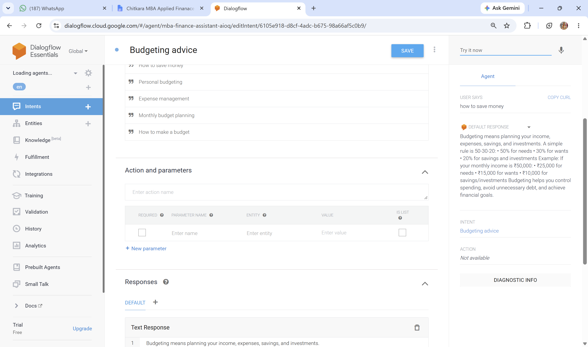
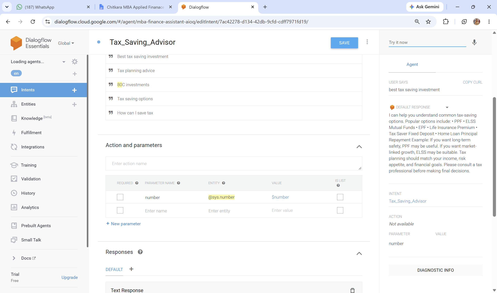
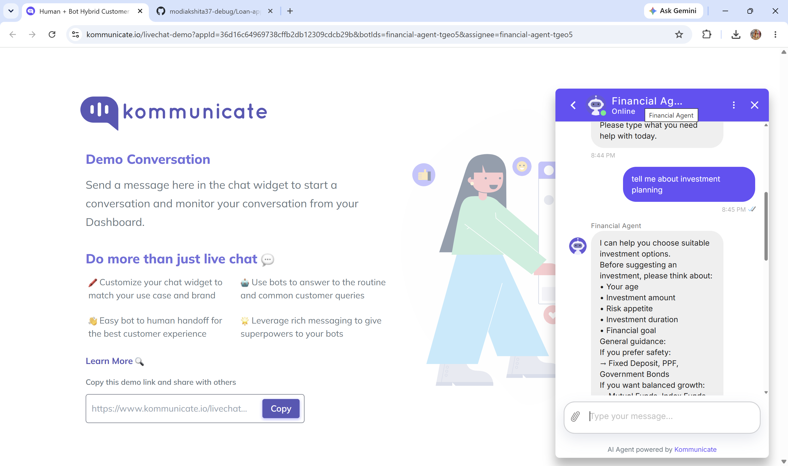

# AI Financial Assistant Chatbot

[🚀 Live Demo](https://www.kommunicate.io/livechat-demo?appId=36d16c64969738cffb2db12309cdcb29b&botIds=financial-agent-tgeo5&assignee=financial-agent-tgeo5)

## Objective
...

## Objective

To build a financial advisory chatbot capable of assisting users with budgeting, tax-saving strategies, EMI calculations, investment planning, and general financial guidance.

---

## Technologies Used

* Dialogflow ES
* Kommunicate
* Natural Language Processing (NLP)
* Conversational AI

---

## Features

### Budget Planning Advice

* Budgeting strategies
* Expense management tips
* Saving recommendations
* Financial planning guidance

### Tax Saving Guidance

* ELSS
* PPF
* Tax-saving investments
* Section 80C options
* Long-term tax planning

### EMI Information

* EMI explanation
* Loan calculations
* Interest impact
* Repayment planning

### Investment Planning

* Risk assessment
* Mutual funds
* Fixed deposits
* Long-term wealth creation

---

## Dialogflow Intents

### Budgeting Advice Intent

### Tax Saving Advisor Intent

---

## Deployment Architecture

User
↓
Kommunicate Chat Interface
↓
Dialogflow ES
↓
Intent Detection
↓
Financial Guidance Response

---

## Kommunicate Deployment

The chatbot was deployed using Kommunicate to provide a user-friendly web-based conversational interface accessible from any device.

### Financial Chatbot Demo

### Investment Planning Conversation

---

## Business Impact

* Provided instant financial guidance through an AI-powered conversational interface.
* Improved user engagement with 24/7 financial assistance.
* Simplified complex financial concepts such as budgeting, taxation, and investments.
* Reduced dependency on manual consultation for basic financial advisory services.
* Enhanced financial awareness and decision-making.

---

## Skills Demonstrated

* Conversational AI Development
* Dialogflow ES
* Natural Language Processing (NLP)
* Intent Design & Management
* Entity Recognition
* Financial Advisory Automation
* Chatbot Development
* Kommunicate Deployment
* User Experience Design
* AI-Powered Customer Support
* Problem Solving & Requirement Analysis

---

## Key Learnings

* Designed and trained a financial chatbot using Dialogflow ES.
* Built conversational flows for budgeting, tax planning, EMI calculations, and investment guidance.
* Integrated Dialogflow with Kommunicate for deployment.
* Applied NLP techniques for intent recognition and response generation.
* Improved chatbot performance through testing and optimization.
* Explored practical applications of AI in financial services.

---

## Project Outcome

Successfully developed and deployed an AI-powered Financial Assistant Chatbot capable of providing personalized financial guidance on budgeting, tax-saving strategies, EMI calculations, and investment planning. The project demonstrates the practical use of Conversational AI and NLP in enhancing financial literacy and customer engagement.

---

## Future Enhancements

* Real-time market data integration
* Personalized investment recommendations
* Multilingual support
* Live financial calculators
* Integration with banking and financial APIs
* Advanced AI-powered financial advisory features

---

## Author

**Yogesh**
MBA Finance | AI & Financial Analytics Enthusiast
